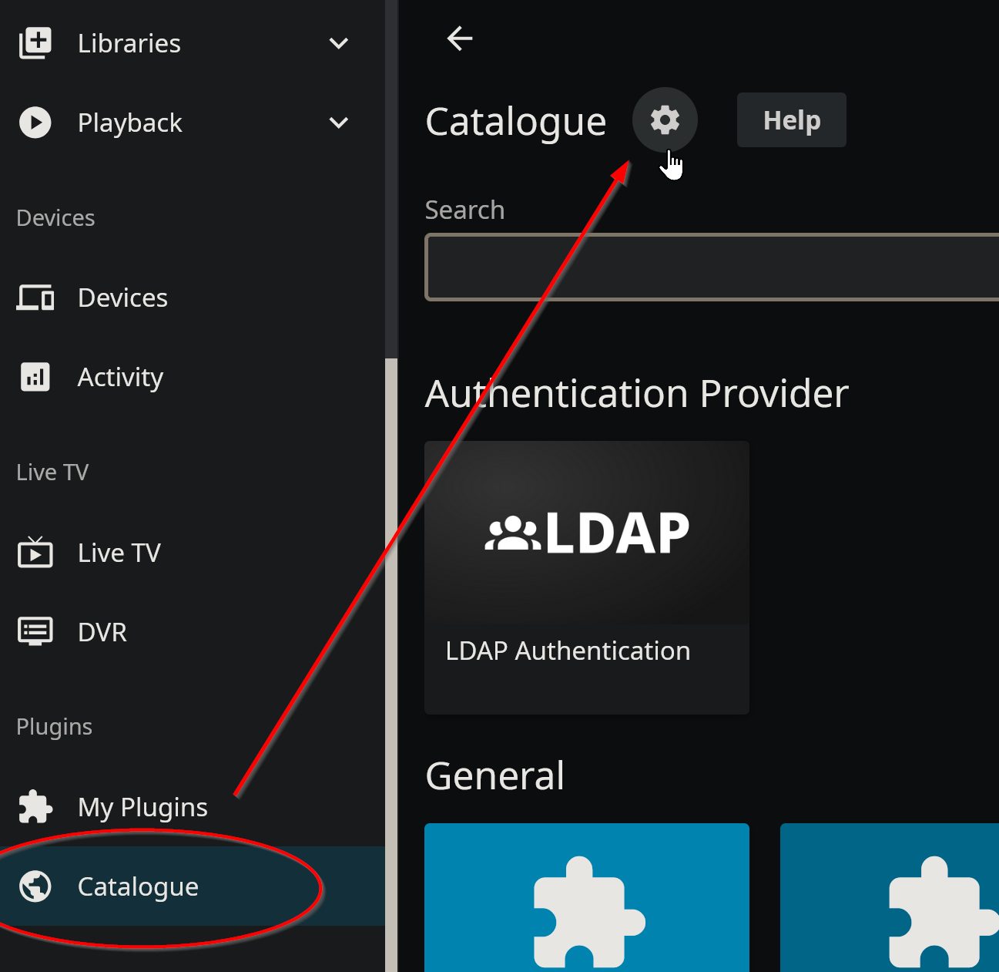
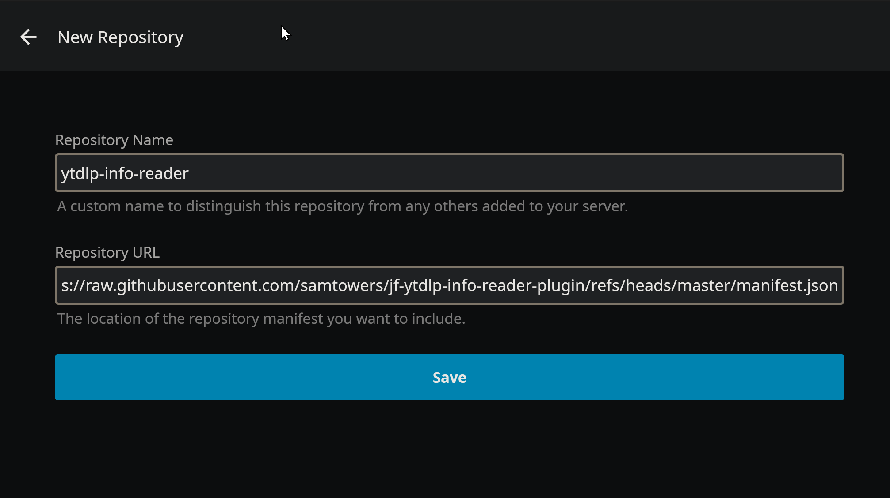
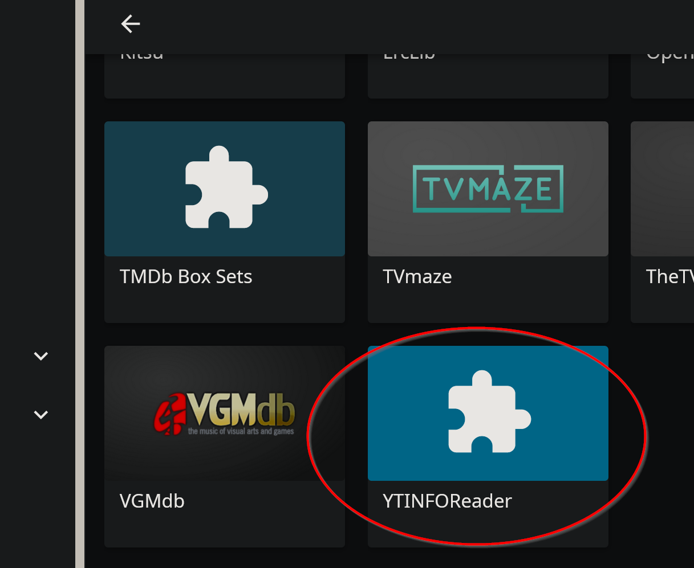

# YouTube INFO reader plugin


This project based on Ankenyr [jellyfin-youtube-metadata-plugin](https://github.com/ankenyr/jellyfin-youtube-metadata-plugin), I removed the remote support
and added what we think make sense for episodes numbers, if you follow active channels like we do, you will notice that
some episodes will have problems in sorting or numbering, we fixed some issues that relates to what we need.

Episodes are named `1` + `MMdd`, plus four integers `XXXX` generated using algo to be consistent across all platforms and you will get
the same episode number.

The reason we prefix the episode numbers by `1` is because we use two month digit, thus if you have episodes that aired `2023-07-02` and `2023-10-02`,
it will prevent the `10-02` episode from appearing before the `07-02` episodes. Usually `0` is not counted in the index so if we do not add `1` before the
index number the episodes index will be `70020000` vs `10020000`.


## Overview
Plugin for [Jellyfin](https://jellyfin.org/) that retrieves metadata for content from yt-dlp `.info.json` files.

### Features
- Reads the `.info.json` files provided by [yt-dlp](https://github.com/yt-dlp/yt-dlp) or similar programs to extract metadata from.
- Supports thumbnails of `png`, `jpg` or `webp` format for both channel and videos.
- Supports the following library types `Movies`, `Music Videos` and `Shows`.
- Supports ExternalID providing quick links to source of metadata.

## Usage

### File Naming Requirements
All media needs to have the ID embedded in the file name within square brackets.
The following are valid examples of a channel and video. We support the following id format
`[(id)]` and `[youtube-(id)]`.

### Channels.
To add metadata from channel, INFO and image should follow the following format. YouTube channels must start with UC or HC.

- `whatever title you want [(youtube-)?(UC|HC)uAXFkgsw1L7xaCfnd5JJOw].info.json`
- `whatever title you want [(youtube-)?(UC|HC)uAXFkgsw1L7xaCfnd5JJOw].(jpg|png|webp)`

### Video files and related metadata.
For Video files it follow the same rules as the channel format.

- `whatever [(youtube-)?dQw4w9WgXcQ].info.json`
- `whatever [(youtube-)?dQw4w9WgXcQ].(jpg|png|webp)`
- `whatever [(youtube-)?dQw4w9WgXcQ].(mkv|mp4|etc)`

# Installation

## As a direct Jellyfin Repository

Open Admin Dashboard.

Click on **Catalogue** and open the settings cog:



Add a new repository from the screen, using the "+" icon.

Add a new entry as below:



Link to the `manifest.json` file directly as listed. For example:

```
https://raw.githubusercontent.com/samtowers/jf-ytdlp-info-reader-plugin/refs/heads/master/manifest.json
```




## Manual Steps

Go to the releases page and download the latest release.

create a folder named `YTINFOReader` in the `plugins` directory inside your Jellyfin data directory. You can find your directory by going to Dashboard, and noticing the Paths section. Mine is the root folder of the default Metadata directory.

Unzip the downloaded file and place the resulting files in the `plugins/YTINFOReader` restart jellyfin.

Go to your YouTube library Make sure `YTINFOReader` is on the top of your `Metadata readers` list. Disable all external metadata sources and only enable `YTINFOReader` in the `Metadata downloaders (TV Shows):` and `Metadata downloaders (Episodes):`.

Tip: Only enable `Image fetchers (Episodes):` - `Screen grabber (FFmpeg)`. if you don't have a local image for the episode, it will be fetched from the video file itself.

## Build and Installing from source

1. Clone or download this repository.
2. Ensure you have .NET Core SDK setup and installed.
3. Build plugin with following command.
    ```
    dotnet publish YTINFOReader --configuration Release --output bin
    ```
4. Create folder named `YTINFOReader` in the `plugins` directory inside your Jellyfin data
   directory. You can find your directory by going to Dashboard, and noticing the Paths section.
   Mine is the root folder of the default Metadata directory.
    ```
    # mkdir <Jellyfin Data Directory>/plugins/YTINFOReader/
    ```
5. Place the resulting files from step 3 in the `plugins/YTINFOReader` folder created in step 4.
    ```
    # cp -r bin/*.dll <Jellyfin Data Directory>/plugins/YTINFOReader/`
    ```
6. Be sure that the plugin files are owned by your `jellyfin` user:
    ```
    # chown -R jellyfin:jellyfin /var/lib/jellyfin/plugins/YTINFOReader/
    ```
If performed correctly you will see a plugin named YTINFOReader in `Admin -> Dashboard -> Advanced -> Plugins`.
